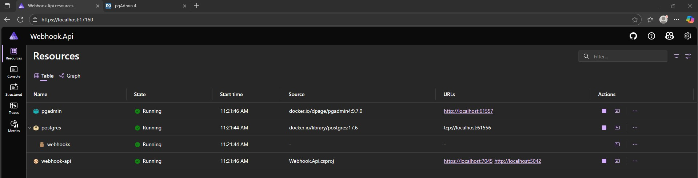
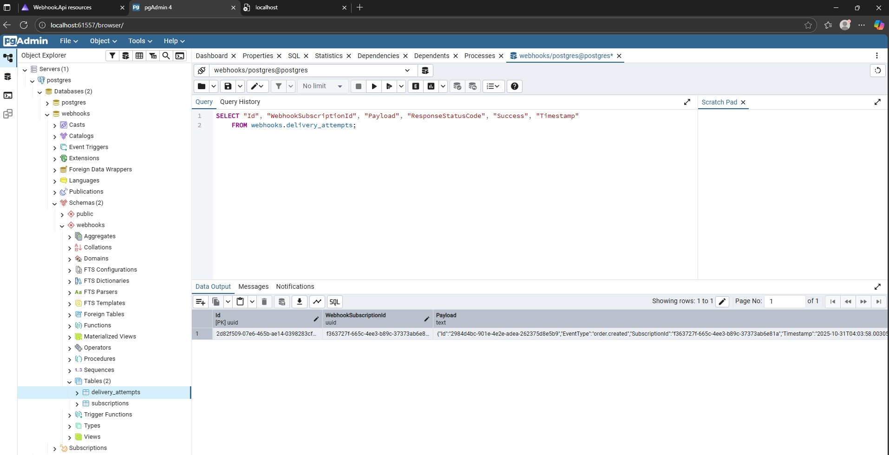
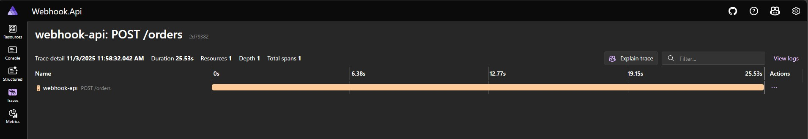
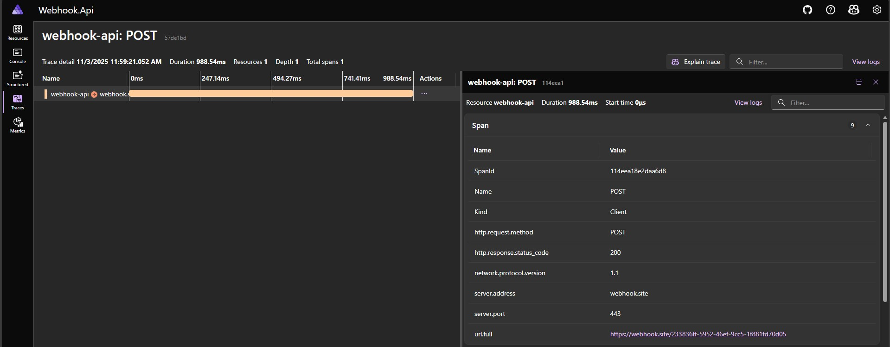
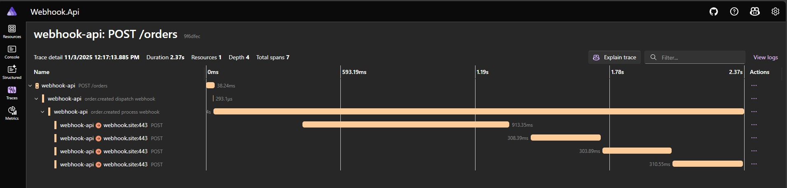
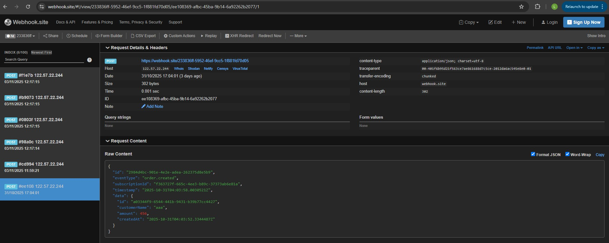

## Webhook.Api

Webhook system example in .NET

### Test webhook
The tutorial suggested using [webhook.site](https://webhook.site/) to test the webhook.
That's how you could see the results in real time and it has a nice UI:


We have created 3 subscriptions for `order.created` event type. Then we called our api to create an order.
The webhook was triggered and we could see the results in the UI.
The raw content that we are passing in request:
```json
{
  "id": "5342e181-fe9d-4379-833d-05d149c6b591",
  "eventType": "order.created",
  "subscriptionId": "d64619c0-e9e1-4b50-9df4-f13d0e30a739",
  "timestamp": "2025-10-31T00:43:10.2700133Z",
  "data": {
    "id": "5f75a24b-a8c4-4872-970f-c078a4893c36",
    "customerName": "string",
    "amount": 123,
    "createdAt": "2025-10-31T00:42:41.0742437Z"
  }
}
```
### Aspire .NET
To instantiate postgres we are using Aspire .NET, scaffolding required projects with IDE templates for that.
```csharp
var database = builder.AddPostgres("postgres")
    .WithDataVolume()
    .WithPgAdmin()
    .AddDatabase("webhooks");
```
Code above shows how to set it up this way in `AppHost.cs`.
The Aspire Dashboard is available at `https://localhost:17160/`

Also this Aspire template creates a pgadmin container that we can use to connect to the database:

And as we can see there is the same record in database that we created in the previous step using our webhook api.

### Decoupling Dispatching of the Event
After we have created a separate channel for dispatching events, the traces show /orders endpoint call as a separate request.

And all webhook calls are in separate requests too.

When we add using of the open telemetry to the project, we can see that the dispatching of the event is done in the same request as the /orders endpoint call. But
the webhook calls still happen in a separate request. That proves that the dispatching of the event is decoupled from the webhook calls.

And when we look at the `Webhook.site`, all new webhook calls are visible there:
