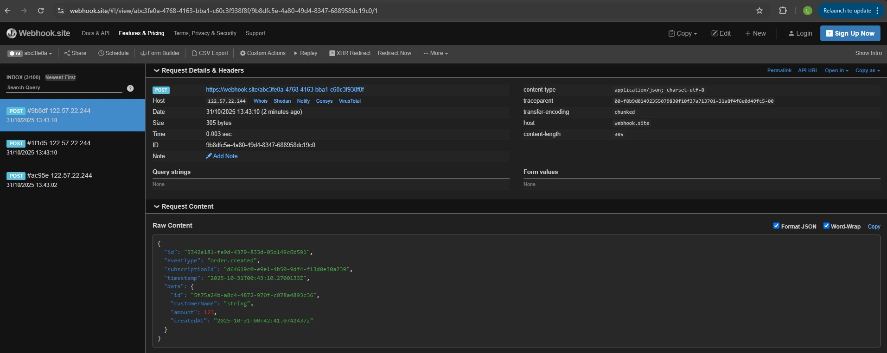

### Webhook.Api

Webhook system example in .NET

#### Test webhook
The tutorial suggested using [webhook.site](https://webhook.site/) to test the webhook.
That's how you could see the results in real time and it has a nice UI:


We have created 3 subscriptions for `order.created` event type. Then we called our api to create an order.
The webhook was triggered and we could see the results in the UI.
The raw content that we are passing in request:
```json
{
  "id": "5342e181-fe9d-4379-833d-05d149c6b591",
  "eventType": "order.created",
  "subscriptionId": "d64619c0-e9e1-4b50-9df4-f13d0e30a739",
  "timestamp": "2025-10-31T00:43:10.2700133Z",
  "data": {
    "id": "5f75a24b-a8c4-4872-970f-c078a4893c36",
    "customerName": "string",
    "amount": 123,
    "createdAt": "2025-10-31T00:42:41.0742437Z"
  }
}
```